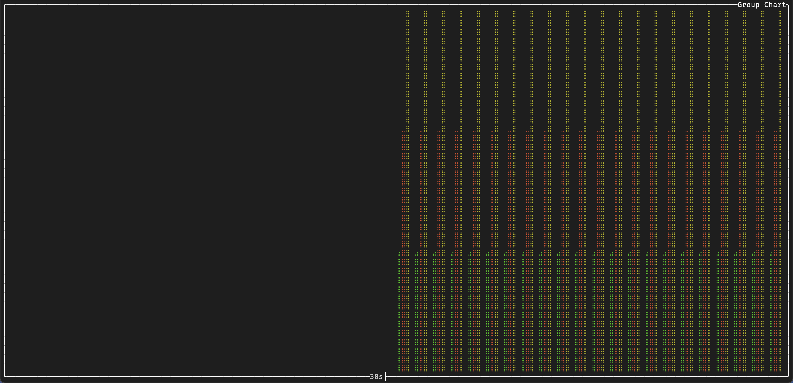

# ttydash


 
 
[](https://deps.rs/repo/github/550w-host/ttydash)
 

## Snapshot


## Installation

```bash
cargo install ttydash
```

## **`ttydash` Usage Guide**

### **Single Line Data Input**

#### **Pure Data Input** (No Title, No Unit)
To input pure data continuously, use the following command:
```bash
while true; echo 1; sleep 0.5; end | ttydash
```

#### **Adding a Title** (Optional)
If you want to add a title to the data chart, just use the `-t` flag:
```bash
while true; echo 1; sleep 0.5; end | ttydash -t "🌟 Title"
```

#### **Adding Units** (Optional)
If each line of data comes with a unit (e.g., "ms"), you can specify the unit with the `-u` flag. 

Example 1️:
```bash
while true; echo 1ms; sleep 0.5; end | ttydash -u ms
```
Example 2️:
```bash
while true; echo 1 ms; sleep 0.5; end | ttydash -u ms
```
👉 Note: The space between the number and the unit is optional.

### ➕ **Multiple Data Points** on the Same Line
To input multiple data points at once, just separate them with a space. For example:
```bash
while true; echo "1 2 3"; sleep 0.5; end | ttydash
```

📊 `ttydash` will plot the data points in the order they are provided!

### 🎯 **Plot Specific Data Points** Using the `-i` Flag
If you only want to plot specific data points, you can use the `-i` flag to select their index. For example:
```bash
while true; echo "1 2 3"; sleep 0.5; end | ttydash -i 1 -i 2
```
In this example, only the data at **index 1** and **index 2** will be plotted.

👉 **Note**: You can switch the sequence of the index as needed. For example:
```bash
ttydash -i 2 -i 1
```
This will plot **index 2** first, followed by **index 1**.

### 📈 **Group Chart**

```bash
while true; echo "1 2 3"; sleep 0.5; end | ttydash -g
```



## flags

```bash
A terminal dashboard for custom monitoring.

Usage: ttydash [OPTIONS] [COMMAND]

Commands:
  add     Add a new regex to the list of regexes
  remove  Remove a regex from the list of regexes
  list    List all regexes
  help    Print this message or the help of the given subcommand(s)

Options:
      --tick-rate <FLOAT>       Tick rate, i.e. number of ticks per second [default: 4]
  -f, --frame-rate <FLOAT>      Frame rate, i.e. number of frames per second [default: 60]
  -t, --titles <STRING>         Chart title, will be shown at the top of the chart
  -u, --units <UNITS>           Unit to be used in the chart (e.g. "ms", "MB")
  -i, --indices <INT>           Index vector to be used in the chart
  -g, --group[=<GROUP>]         Group together to show multiple charts in the same window [default: false] [possible values: true, false]
      --update-frequency <INT>  Update frequency, i.e. number of milliseconds between updates [default: 1000]
  -h, --help                    Print help
  -V, --version                 Print version
```