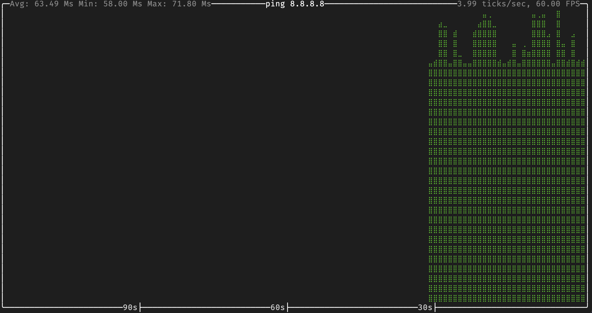

# ttydash


 
 
[](https://deps.rs/repo/github/550w-host/ttydash)
 


## Snapshot



## Usage

### Example 1
```bash
ping 8.8.8.8 | ttydash -u ms
```

## flags

```bash
A rust based tty plot

Usage: ttydash [OPTIONS]

Options:
      --tick-rate <FLOAT>   Tick rate, i.e. number of ticks per second [default: 4]
  -f, --frame-rate <FLOAT>  Frame rate, i.e. number of frames per second [default: 60]
  -t, --title <STRING>      Chart title, will be shown at the top of the chart
  -u, --unit <UNIT>         Unit to be used in the chart [possible values: ms, s, mb, kb, gb, ki-b, mi-b, gi-b]
  -h, --help                Print help
  -V, --version             Print version
```